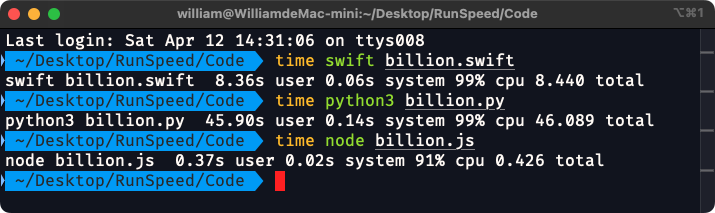

# [Speed Comparison - Count to 1 Billion](https://youtu.be/yZNGRXoq9Ls)

## Apple Mac mini - Apple M4 / 24GB

|Language|Version|File|Time|
|-|-|-|-|
|[gcc](https://zh.wikipedia.org/zh-tw/GCC)|v16.0.0|billion.c|0.31s|
|[g++](https://zh.wikipedia.org/zh-tw/GCC)|v16.0.0|billion.cpp|0.28s|
|[python](https://www.python.org/)|v3.9.6|billion.py|45.90s|
|[node.js](https://nodejs.org/)|v22.14.0|billion.js|0.37s|
|[go](https://go.dev/)|v1.24.0|billion.go|0.33s|
|[objective-C](https://zh.wikipedia.org/zh-tw/Objective-C)|v16.0.0|billion.m|0.39s|
|[swift](https://www.swift.org/)|v6.0.3|billion.swift|8.36s|
|[java](https://www.java.com/)|v21.0.6|billion.java|0.36s|
|[rust](https://www.rust-lang.org/)|v1.86.0|billion.rs|0.57s|

## Code



#### gcc
```c
gcc billion.c -o billion
time ./billion
```

#### g++
```c++
g++ billion.cpp -o billion
time ./billion
```
#### python
```py
time python3 billion.py
```

#### node.js
```js
time node billion.js
```

#### go
```go
time go run billion.go
```

#### objective-c
```objc
gcc -framework Foundation billion.m -o billion
time ./billion
```

#### swift
```swift
time swift billion.swift
```

#### java
```swift
time java billion.java
```

#### rust
```rust
rustc billion.rs
time ./billion
```